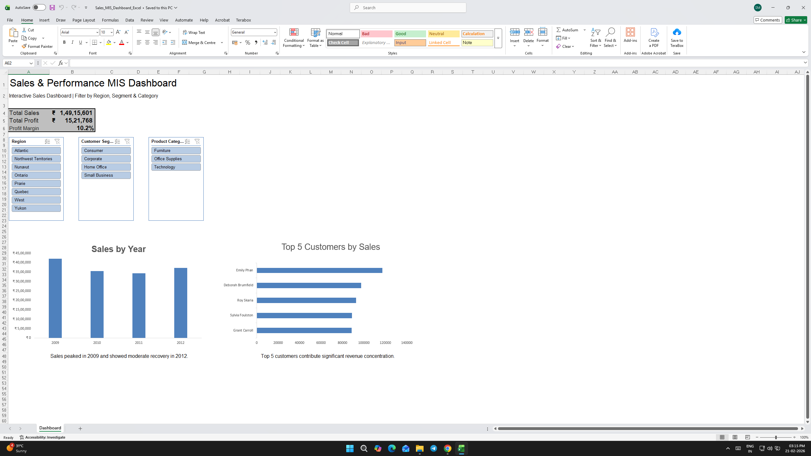

# Sales MIS Dashboard (Excel)

## Dashboard Preview

## Project Overview
Built an interactive Excel Sales MIS Dashboard to analyze multi-thousand row transactional data and deliver actionable business insights.

## Business Problem
Manual sales reporting was time-consuming and lacked visibility into revenue trends, regional performance, and product contribution.

## Objective
To analyze multi-thousand-row sales data and create a dynamic reporting interface for tracking revenue trends, regional performance, and product contribution.

## Key Features
- Pivot Tables for data aggregation
- Dynamic slicers for interactive filtering
- KPI tracking (Sales, Profit, Margin)
- INDEX-MATCH for backend data mapping
- Structured workbook architecture (Raw → Backend → Dashboard)

## Dataset
Multi-thousand-row (5,000+ records) transactional sales dataset covering revenue, profit, region, and product categories.

## Tools Used
- Microsoft Excel (Pivot Tables, Slicers,  Conditional Formatting)

## Business Insights Enabled
- Revenue trend analysis
- Region-wise performance comparison
- Product contribution evaluation
- Customer segmentation visibility

## Impact
- Reduced manual reporting effort
- Enabled region-wise and product-wise performance tracking
- Improved visibility into sales KPIs (Revenue, Profit, Margin)

## Workbook Structure
- Implemented layered architecture separating Raw Data → Transformation Layer → Aggregation → Presentation Dashboard.
- Raw Data Sheet
- Backend Calculations
- Pivot Tables
- Interactive Dashboard
